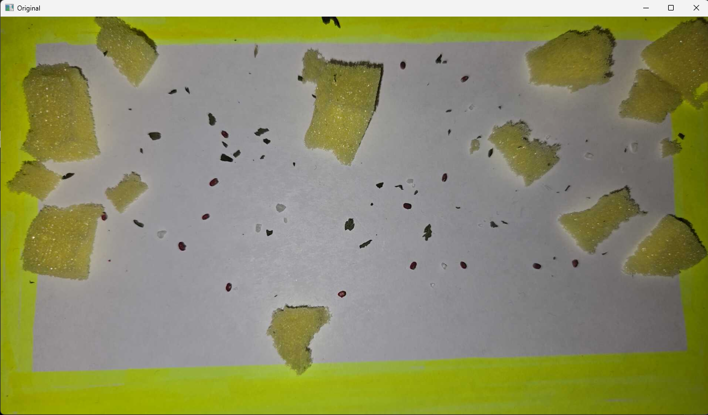

# VarroaVision: Computer Vision Mite Detection
VarroaVision is a computer vision tool designed to assist beekeepers in combating Varroa mite infestations in beehives. By automating the counting process on beehive boards, the system provides accurate, data-driven insights into hive health based on government-standard thresholds.

## Background
This project was developed for ESC102 and demonstrated live at the Year-End Showcase.

## Our Solution
Manual mite counting is tedious and prone to human error. This project implements a Human-in-the-Loop (HITL) pipeline that combines automated image processing with user verification to ensure accurate results.

### Key Features
- **IP Camera Integration**: Supports real-time image capture from remote cameras.
- **Dynamic Calibration**: A "Reference Photo" system that allows users to define a "standard mite size," making the algorithm adaptable to different camera heights and lighting.
- **Dual-Range HSV Segmentation** – Uses two HSV masking ranges to isolate the distinct reddish-brown colour of mites while filtering out common debris.
- **Heuristic Filtering**: Automated contour analysis that filters detections by area (rejecting large hive debris or microscopic dust).
- **Analytics**: Logs session results to CSV and generates temporal trend graphs using Matplotlib for hive health tracking.

## How it Works
1. Calibration – User captures a reference image and defines a mite size baseline.
2. Preprocessing – Image normalization and colour space conversion improve mite contrast.
3. Masking – Dual-range HSV masking isolates potential mite regions.
4. Verification – User may confirm or reject edge-case detections.
5. Output – Final mite count is displayed alongside historical trends from past sessions.

| Original Image | Masked Mites | Mite Count |
|----------------|--------------|------------|
|  |  |  |
